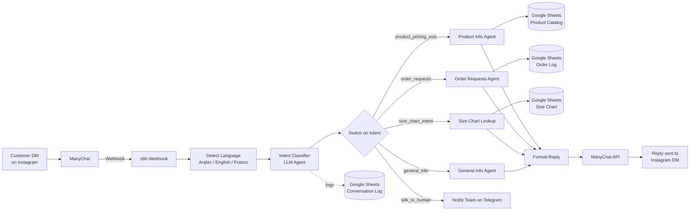
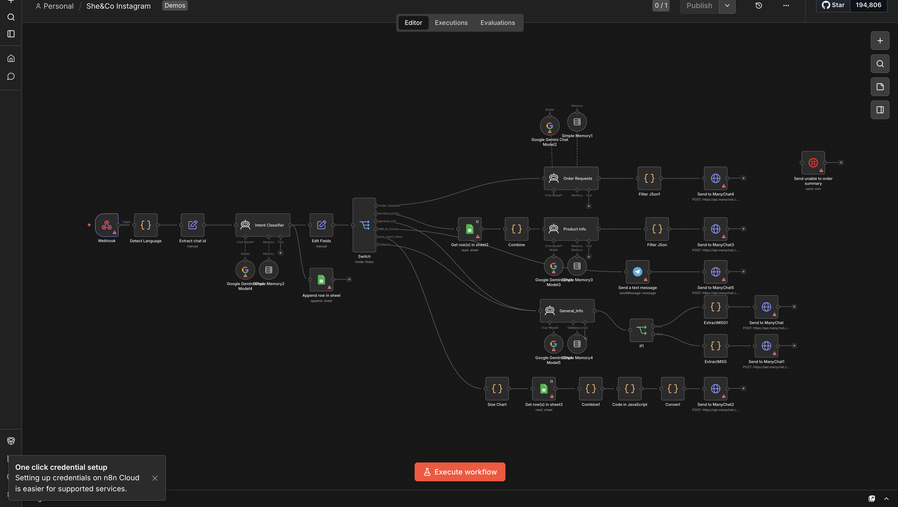

# Instagram Brand — AI Customer Service Chatbot for Instagram DMs

An AI-powered customer service automation built for **Instagram Brand**, a DTC fashion/apparel brand, to handle Instagram DM conversations automatically — product questions, order requests, sizing, and general FAQs — with a smart handoff to a real human when the bot shouldn't (or can't) handle the conversation.

> This repo contains a **sanitized version** of a production workflow built for a real client. All credentials, account IDs, spreadsheet IDs, brand-identifying details, and customer data have been removed or replaced with placeholders. See [Setup](#setup) to run your own copy.

## The problem

Instagram Brand gets a high volume of Instagram DMs — "do you have this in size M?", "where's my order?", "is this hijabi-friendly?" — and answering each one manually doesn't scale. The brand needed a bot that could handle the repetitive 80% automatically, stay on-brand, reply in whatever language/style the customer is comfortable in, and *know its limits* — stepping aside immediately when a real person is needed.

## How it works, end to end

1. **Message comes in** — a customer DMs the brand's Instagram, ManyChat receives it and forwards it to an n8n webhook.
2. **Language is detected** — a script checks the raw text for Arabic script vs. Latin characters and picks a reply language (see [Language handling](#language-handling-arabic--english--franco) below).
3. **Intent Classifier agent** reads the message (plus the last user/bot turn, for context) and outputs exactly one label: `product_pricing_size`, `order_requests`, `general_info`, `size_chart_intent`, or `talk_to_human`. It's instructed to output *only* the label — no chit-chat — so the Switch node can route on it reliably.
4. **The Switch node routes to a specialized agent:**
   - **Product Info Agent** — answers questions against a live Google Sheet product catalog (27+ SKUs), handles follow-ups like "what about in blue?" using conversation memory, and always redirects actual purchases to the website (the bot never takes orders itself).
   - **Order Requests Agent** — handles tracking, returns, exchanges, and defective-item reports. It follows a strict scripted flow (ask for email → if unavailable, ask for phone number → hand off) and returns the brand's exact return/exchange policy verbatim when asked, rather than improvising legal-ish claims.
   - **General Info Agent** — shipping zones, delivery costs, restock/discount info, and hiring inquiries, answered only from an approved knowledge base (never invented).
   - **Size Chart lookup** — pulls sizing data for whatever product was last discussed, even if the current message alone ("what size should I get?") doesn't name it.
5. **Reply gets formatted and sent back** through the ManyChat API into the customer's Instagram DM.
6. **Every intent + message is logged** to a Google Sheet for QA and analytics.

## When it hands off to a real human

This is the part that matters most for customer trust. The Intent Classifier is explicitly instructed to route to `talk_to_human` — bypassing every other agent — when:

- The customer directly asks for a person ("can I talk to someone?", "I want a real agent", "is anyone real there?")
- The message shows **clear frustration or anger** — insults, ALL CAPS, "this is useless," "you're not helping," etc.
- The customer sends a phone number, email, PDF, or file on its own (usually a sign they've given up on the bot and want a human to just handle it)
- The conversation has *already* been escalated once — the bot keeps deferring to a human rather than trying to re-engage, unless the new message is a clearly unrelated, neutral question

When this fires, the bot doesn't attempt customer service anymore. It immediately sends a short, warm, no-friction message ("Thank you, someone from our team will contact you shortly!") and pings the team on **Telegram in real time** with the conversation so a human can jump in fast — no ticket queue, no delay.

The design intent here: the bot never argues with an upset customer or tries to "handle" anger with scripted empathy. The moment things go sideways, it gets out of the way.

## Language handling: Arabic, English, or Franco

The brand's customers write in three different ways, so language handling isn't a single toggle:

- **Arabic script** (e.g. "عايزة أعرف السعر") → detected via Unicode range matching → bot replies fully in **Egyptian Arabic slang**, matching how the brand actually talks to customers (not formal/MSA Arabic).
- **English** → detected as the default → bot replies in plain English.
- **Franco / Arabizi** (Arabic typed with a Latin keyboard, e.g. "3ayza asa'al 3an el se3r," using numbers like `3`, `7`, `2`, `5` to stand in for Arabic letters that don't exist in the Latin alphabet) → detected via a pattern match for numbers mixed into words → currently normalized to an **English reply**, since that's the tone the brand chose for that group of customers.

Once a language is picked for the conversation, every agent is instructed to **commit to it fully** — never mixing Arabic and English in the same reply, and never re-detecting language mid-conversation based on how the customer phrases the next message. This avoids the awkward experience of a bot flip-flopping languages mid-chat.

## Brand-specific behavior baked into the bot

A few examples of how the bot was tuned to match this specific brand's product line and voice, rather than being a generic FAQ bot:
- Tops are always described as "100% double layered front and back" — a real product feature customers ask about constantly.
- Product line is confirmed hijabi-friendly whenever asked.
- Hiring/vacancy questions are recognized as their own case — the bot asks for a CV and phone number rather than treating it as a support ticket.
- Return/exchange policy text is reproduced *exactly* as written by the brand, never paraphrased by the LLM — important for anything that's effectively a policy commitment.

## Architecture

Each intent agent runs on **Google Gemini** with its own short-term conversation memory buffer, so the bot maintains context across a back-and-forth conversation (e.g. "what about in blue?") rather than treating every message as brand new.

## Tech stack

| Layer | Tool |
|---|---|
| Orchestration | [n8n](https://n8n.io) (self-hosted workflow automation) |
| LLM / agents | Google Gemini via LangChain agent nodes |
| Messaging channel | Instagram DMs via [ManyChat](https://manychat.com) API |
| Data store | Google Sheets (product catalog, size chart, order log, conversation log) |
| Human escalation | Telegram Bot API |
| Logic | n8n Code nodes (JavaScript) for language detection, parsing, and formatting |

## Setup

This workflow is built for [n8n](https://n8n.io) (Cloud or self-hosted).

1. Import [`workflows/she-and-co-instagram-chatbot.json`](workflows/she-and-co-instagram-chatbot.json) into your n8n instance (**Workflows → Import from File**).
2. Configure credentials for:
   - Google Gemini (or swap in any LLM supported by n8n's LangChain nodes)
   - Google Sheets OAuth
   - Telegram Bot API
   - ManyChat (HTTP Header Auth, using your ManyChat API key)
3. Create three Google Sheets: a product catalog, a size chart, and a conversation log — update the `documentId` fields in the Google Sheets nodes to point to yours.
4. Set your Telegram `chatId` in the "Send a text message" node to the ID of whoever should receive human-handoff alerts.
5. In ManyChat, point your Instagram automation's webhook action at the n8n Webhook node's URL, and set the header auth to match.
6. Activate the workflow.

## Screenshot

## Notes

- This is a sanitized export of a live client workflow — node names like `ManyChat3`, `Filter JSon1` etc. reflect real production iteration, not a polished demo.
- Client name is anonymized here for confidentiality; happy to discuss specifics privately.
- Built and iterated in close collaboration with the client based on real customer conversation patterns and edge cases.